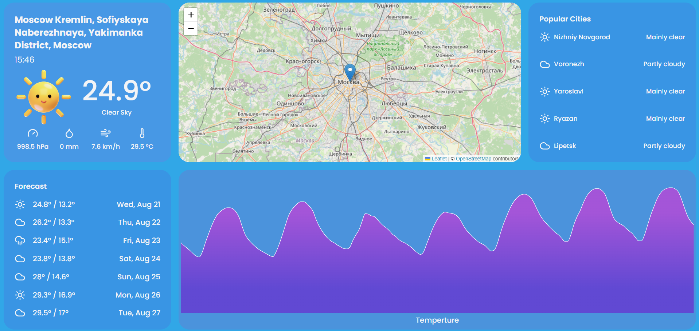

# TempMate Application README

## Introduction

Welcome to **TempMate**, your go-to weather information application. TempMate provides accurate and up-to-date weather information for any city around the globe. Whether you're planning a trip or just curious about the weather, TempMate has you covered.

## Features

- **Real-time Weather Data**: Get current weather conditions, temperature, humidity, wind speed, and more.
- **Search by City**: Simply enter the name of the city to get instant weather updates.
- **Responsive Design**: Enjoy a seamless experience on both desktop and mobile devices.

## Getting Started

### Prerequisites

To use TempMate, you only need a web browser and an internet connection.

### Accessing TempMate

You can access the TempMate application through the following URL: [TempMate](https://varungaikwad.github.io/temp-mate/).

## Using TempMate

**Homepage**: On the homepage, you will find a search bar where you can enter the name of the city you want to check the weather for.

## Technologies Used

- **Frontend**: React.js for building the user interface.
- **Backend**: Node.js for server-side logic.
- **API**: Weather data is fetched from [Open-Meteo](https://open-meteo.com/).
- **Hosting**: Vercel for seamless deployment and hosting.

## Contributing

We welcome contributions from the community. To contribute to TempMate, please follow these steps:

1. Fork the repository.
2. Create a new branch for your feature or bug fix.
3. Make your changes and commit them.
4. Push your changes to your fork.
5. Create a pull request to the main repository.

## License

TempMate is licensed under the MIT License. See the LICENSE file for more details.

## Contact

For any questions or suggestions, feel free to reach out to us at:

- **Email**: gaikwadvarun23@gmail.com
- **LinkedIn**: [Varun Gaikwad](https://www.linkedin.com/in/varun-gaikwad/)

Thank you for using TempMate! We hope you have a great experience with our application.
